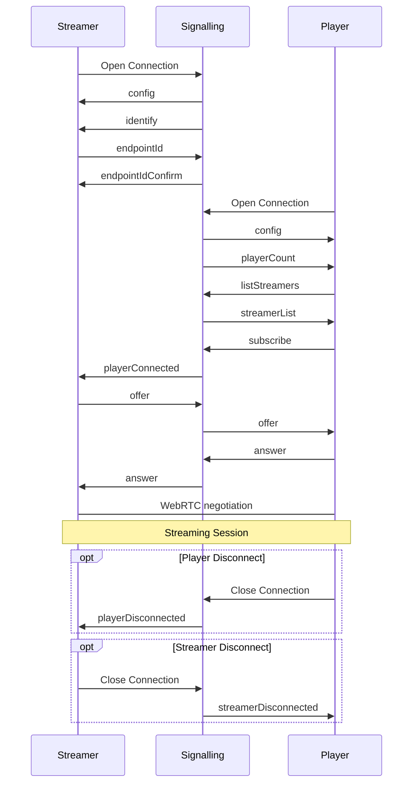

# Pixel Streaming Signalling Protocol

The following is a complete reference to the current signalling server messaging protocol. These messages are sent as stringified JSON packets. Some parameters are JSON strings themselves and require escape sequences to be contained in the string parameter.

## Version
1.1.0 - Current

Major version number - breaking protocol change such as a required new message or field or deleting an existing message.  
Minor version number - independent new message.  
Hotfix version - a non-breaking new field in an existing message type.  

## Table of Contents
- [Terms](#terms)
- [Example Streaming Message Sequence](#example-message-sequence)
- [Player Sent Messages](#source-player)
	- [answer](#player-answer)
	- [dataChannelRequest](#player-datachannelrequest)
	- [iceCandidate](#player-icecandidate)
	- [listStreamers](#player-liststreamers)
	- [offer](#player-offer)
	- [peerDataChannelsReady](#player-peerdatachannelsready)
	- [stats](#player-stats)
	- [subscribe](#player-subscribe)
	- [unsubscribe](#player-unsubscribe)
- [SFU Sent Messages](#source-sfu)
	- [answer](#sfu-answer)
	- [offer](#sfu-offer)
	- [peerDataChannels](#sfu-peerdatachannels)
	- [streamerDataChannels](#sfu-streamerdatachannels)
    - [startStreaming](#sfu-startstreaming)
    - [stopStreaming](#sfu-stopstreaming)
- [Signalling Server Sent Messages](#source-signalling)
	- [config](#signalling-config)
	- [identify](#signalling-identify)
    - [endpointIdConfirm](#signalling-endpointidconfirm)
	- [streamerIdChanged](#signalling-streameridchanged)
	- [playerConnected](#signalling-playerconnected)
	- [playerCount](#signalling-playercount)
	- [playerDisconnected](#signalling-playerdisconnected)
	- [pong](#signalling-pong)
	- [streamerDisconnected](#signalling-streamerDisconnected)
	- [streamerList](#signalling-streamerlist)
- [Streamer Sent Message](#source-streamer)
	- [answer](#streamer-answer)
	- [disconnectPlayer](#streamer-disconnectplayer)
	- [endpointId](#streamer-endpointid)
	- [iceCandidate](#streamer-icecandidate)
	- [layerPreference](#streamer-layerpreference)
	- [offer](#streamer-offer)
	- [ping](#streamer-ping)

## Terms

### Signalling Server

>The server that is responsible for routing messageas and controlling new connections.

### Streamer

> The entity that is streaming the media.

### Player

> A consumer of the stream. Could be passive or active with the use of data streams.

### SFU

> Selective Forwarding Unit. This is a special type of Player that consumes the stream and then can forward the stream to new connected Players. This is useful when many users need to be consuming the stream and encoding resources on the Streamer are not adequate to keep up with the demand.
> Additionally allows the use of simulcast which allows the Streamer to stream a handful of different quality streams that the SFU can selectively forward to individual Players based on their connection quality.

### SDP

> Session Description Protocol. A message format that is used to negotiate a media connection between two endpoints. There are many resources for further details such as [here](https://www.tutorialspoint.com/webrtc/webrtc_session_description_protocol.htm) or [here](https://webrtchacks.com/sdp-anatomy/)

### ICE Candidate

> Interactive Connectivity Establishment. Describes protocols and routing needed for WebRTC to be able to communicate with a remote device. Further details can be read [here](https://developer.mozilla.org/en-US/docs/Web/API/RTCIceCandidate)

## Example Streaming Message Sequence

